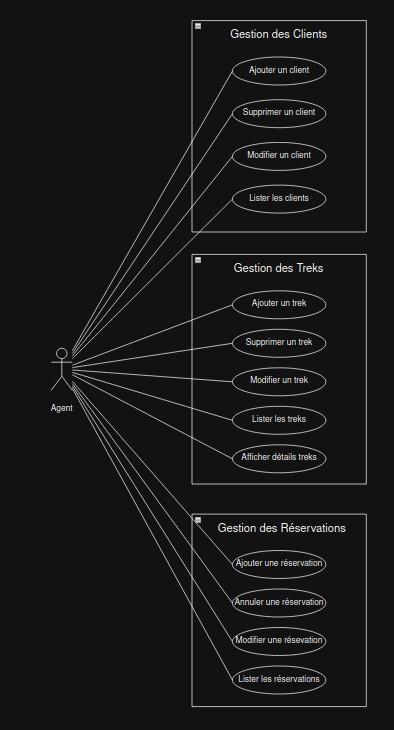
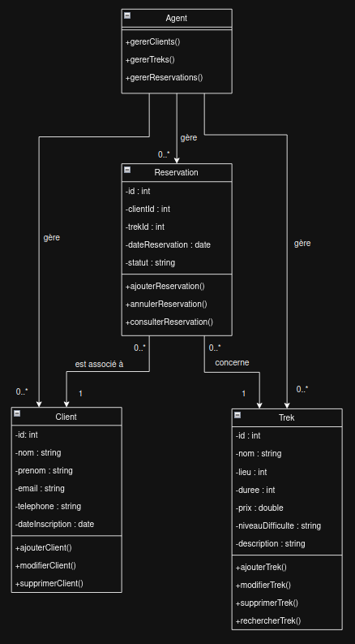

# Documentation

## Énoncé

Développer une application en C++ pour une agence de voyage spécialisée dans l'organisation de treks. Le programme devra gérer les clients, les treks disponibles, les réservations, et intégrer une API météo pour fournir des informations sur les conditions climatiques des destinations. Une interface graphique permettra aux utilisateurs de gérer et de consulter les données facilement.

---

## Conception

Nous utilisons **Draw.io** pour créer les diagrammes suivants :

- **Diagramme des cas d'utilisation** : Représente les interactions principales.

- **Diagramme de classe** : Modélise les relations entre les entités.

---

## Développement

### Pré-requis

1. Installer les bibliothèques nécessaires (**libs**) :
   - (Liste des bibliothèques à ajouter ici)

### Structure du projet

1. Créer le dossier principal : `AgenceVoyageIHM`.
2. Créer le premier fichier : `main.cpp`.
3. Créer le dossier pour stocker les documents : `Documents`

---
